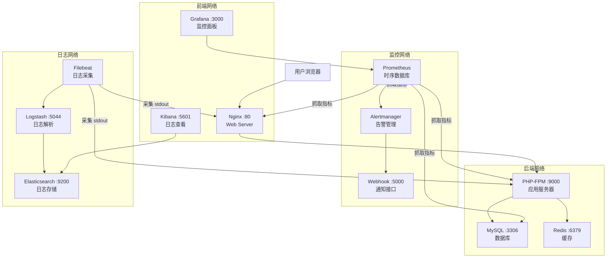

# Docker LNMP Platform

> 容器化多环境 LNMP 全栈运维平台  
> Nginx + PHP-FPM + MySQL + Redis | ELK 日志中心 | Prometheus + Grafana 监控 | 一键部署

[](https://docker.com)
[](https://docs.docker.com/compose/)
[](https://nginx.org)
[](https://php.net)
[](https://mysql.com)
[](https://redis.io)
[](https://elastic.co)
[](https://grafana.com)

---

## 项目简介

面向简历的 DevOps 全栈运维项目。用 Docker Compose 编排一套生产级 LNMP 环境，整合可观测性三件套（日志、监控、告警），体现多环境管理、自动化部署和故障自愈的完整运维思维。

共编排 **16 个容器**，覆盖 Web 服务、数据库、缓存、日志采集、监控告警全链路。

---

## 整体架构



---

## 技术亮点

| 模块 | 能力 | 体现的运维思维 |
|------|------|---------------|
| **多环境** | dev/staging/prod 配置分离，`.env` 集中管理 | 环境隔离，配置即代码 |
| **健康检查** | 16 个容器全部配置 healthcheck，进程级检测 | 故障自愈，可观测性 |
| **故障转移** | PHP-FPM 宕机时 Nginx 自动返回维护页 | 优雅降级，非 502 白页 |
| **日志中心** | Filebeat + Logstash + ES + Kibana，Nginx 日志结构化解析 | 集中式日志，快速排障 |
| **监控告警** | Prometheus 抓取 6 个 Exporter，Grafana 自动配置数据源 | 指标可视化，趋势预警 |
| **通知** | Alertmanager → Webhook，预留钉钉/飞书接口 | 告警闭环 |
| **一键部署** | `deploy.sh` 自检环境 + 等待健康 + 输出地址 | 标准化交付 |
| **自验证** | `test.sh` 10 项测试，覆盖功能、故障、高负载场景 | 质量保证 |

---

## 快速开始

### 前置要求

```bash
docker --version               # >= 24
docker compose version          # Compose V2
```

建议配置：2 核 CPU、4GB 内存、20GB 磁盘。

### 克隆与启动

```bash
git clone https://github.com/reirororo/Docker-LNMP-Platform.git
cd Docker-LNMP-Platform

# 开发环境（默认暴露 DB/Redis 端口，方便调试）
make dev

# 或手动执行
docker compose -f docker-compose.yml -f docker-compose.dev.yml up -d --build
```

首次启动需要拉取镜像和编译 PHP 镜像，耗时 3-5 分钟。启动后访问 http://localhost 即可看到系统探针页。

### 生产环境

```bash
# 1. 编辑 .env，设置强密码
vim .env

# 2. 启动（不暴露数据库端口）
make prod
```

### 停止与清理

```bash
make down          # 停止所有容器
make clean         # 停止并删除数据卷（数据会丢失）
```

---

## 服务访问入口

| 服务 | 地址 | 默认凭证 | 说明 |
|------|------|----------|------|
| Nginx + PHP | http://localhost:80 | - | 系统探针页 |
| Kibana | http://localhost:5601 | - | 日志查看 |
| Grafana | http://localhost:3000 | admin / admin | 监控面板 |
| Prometheus | http://localhost:9090 | - | 指标查询 |
| Alertmanager | http://localhost:9093 | - | 告警管理 |
| Alert Webhook | http://localhost:5000 | - | 告警接收器 |
| MySQL | localhost:3306 (仅 dev) | root / root123 | 数据库 |
| Redis | localhost:6379 (仅 dev) | redispass | 缓存 |

---

## 环境配置

### 开发 vs 生产

| 配置项 | 开发 (dev) | 生产 (prod) |
|--------|-----------|-------------|
| MySQL 端口暴露 | :3306 | 不暴露 |
| Redis 端口暴露 | :6379 | 不暴露 |
| Elasticsearch 端口 | :9200 | 不暴露 |
| PHP display_errors | On | Off |
| Nginx 安全头 | 基础 | 完整（X-Frame-Options 等） |

### 环境变量

通过 `.env` 文件集中管理配置，主要变量：

| 变量 | 默认值 | 说明 |
|------|--------|------|
| APP_ENV | dev | 环境模式 |
| NGINX_PORT | 80 | Nginx 监听端口 |
| MYSQL_ROOT_PASSWORD | root123 | 数据库 root 密码 |
| MYSQL_PASSWORD | apppass | 应用用户密码 |
| REDIS_PASSWORD | redispass | Redis 密码 |
| GRAFANA_ADMIN_PASSWORD | admin | Grafana 管理员密码 |
| ES_JVM_HEAP | 256m | ES 堆内存 |

---

## 监控与告警

### Grafana 仪表盘

Grafana 启动后自动配置了 Prometheus 和 Elasticsearch 数据源（通过 provisioning）。

1. 访问 http://localhost:3000，默认账号 admin / admin
2. 进入 Dashboards → Import
3. 导入社区仪表盘 ID：
   - `11159` — Nginx 监控
   - `7362` — MySQL 监控
   - `1860` — Node Exporter 系统监控

### 预置告警规则

```yaml
NginxRequestRateDrop   # 请求速率接近零（警告 -> upstream 异常）
MySQLConnectionsHigh   # 连接数超过 80%（警告）
RedisMemoryHigh        # 内存使用超过 80%（警告）
ContainerDown          # 容器离线 1 分钟（严重）
```

告警默认发送到内置的 Webhook 接收器（http://localhost:5000）。如需对接钉钉/飞书，修改 `alerts/alertmanager.yml` 中的 URL。

---

## 日志中心

访问 http://localhost:5601 进入 Kibana。

**首次使用：**
1. 进入 Stack Management → Index Patterns
2. 创建索引模式 `lnmp-logs-*`
3. 时间筛选字段选择 `@timestamp`
4. 进入 Discover 查看实时日志流

Nginx 和 PHP 日志已结构化解析（状态码、响应时间、来源 IP 等字段），可直接在 Kibana 中搜索和过滤。

---

## 故障测试与验证

```bash
make test
```

`test.sh` 自动执行 10 项测试，覆盖：

| # | 测试内容 | 验证点 |
|---|---------|--------|
| 1 | PHP 探针页响应 | 200 状态码 |
| 2 | Nginx 健康端点 | health 端点返回 200 |
| 3 | PHP-FPM 容器运行 | 容器状态 = running |
| 4 | MySQL 连接 | PHP 探针页显示已连接 |
| 5 | Redis 连接 | PHP 探针页显示已连接 |
| 6 | Prometheus 抓取 | 有 healthy target |
| 7 | Grafana API | health 接口响应正常 |
| 8 | Kibana API | status 接口响应正常 |
| 9 | 故障转移 | 停掉 PHP 后 Nginx 返回维护页 |
| 10 | Alertmanager | ready 接口响应正常 |

---

## 目录结构

```
Docker-LNMP-Platform/
├── docker-compose.yml           # 基础服务定义（16个容器）
├── docker-compose.dev.yml       # 开发环境覆写
├── docker-compose.prod.yml      # 生产环境覆写
├── .env.example                 # 环境变量模板
├── deploy.sh                    # 一键部署脚本
├── test.sh                      # 自验证脚本
├── Makefile                     # 常用命令
│
├── nginx/                       # Web 服务器
│   ├── default.conf             # 安全头、stub_status、fastcgi
│   └── maintenance.html         # PHP-FPM 故障转移页面
│
├── php/                         # 应用服务器
│   ├── Dockerfile               # 8.2-fpm + pdo_mysql + redis
│   ├── php.ini                  # PHP 运行时配置
│   └── www.conf                 # FPM 进程池、status/ping 端点
│
├── mysql/
│   └── init.sql                 # 建库建表 + 示例数据
│
├── www/
│   └── index.php                # 系统探针页（DB/Redis/扩展检测）
│
├── filebeat/
│   └── filebeat.yml             # 容器日志采集（stdout/stderr）
│
├── logstash/
│   └── pipeline/nginx.conf      # 日志解析（Grok 结构化）
│
├── prometheus/
│   ├── prometheus.yml           # 抓取 6 个 Exporter
│   └── rules.yml                # 4 条告警规则
│
├── grafana/
│   └── provisioning/            # 自动配置数据源和仪表盘
│
├── alerts/
│   └── alertmanager.yml         # Webhook 通知
│
└── README.md
```

---

## 资源占用

| 服务 | 内存 (MB) | 说明 |
|------|-----------|------|
| Nginx | ~20 | 静态文件 + 反向代理 |
| PHP-FPM | ~60 | 4 个 worker 进程 |
| MySQL | ~200 | 含 query cache |
| Redis | ~10 | 内存缓存 |
| Elasticsearch | ~260 | JVM 堆 256m |
| Logstash | ~260 | JVM 堆 256m |
| Filebeat | ~20 | 日志采集 |
| Kibana | ~150 | 可视化 |
| Prometheus | ~100 | 指标存储 |
| Grafana | ~80 | 面板 |
| Exporter x 5 | ~50 | 指标暴露 |
| 合计 | ~1.2 GB | 建议 4GB+ |

---

## 故障排除

**端口冲突**  
修改 `.env` 中的端口号后执行 `make restart`。

**容器反复重启**  
`docker compose logs <service>` 查看具体错误日志。

**PHP 探针页 502 Bad Gateway**  
MySQL 或 Redis 尚未就绪。脚本会自动等待健康检查通过，首次启动约 30-60 秒。

**Kibana "No default index pattern"**  
在 Stack Management → Index Patterns 中创建 `lnmp-logs-*`，时间字段选 `@timestamp`。

**Grafana 数据源显示 "Not found"**  
Prometheus 容器需要 10-15 秒完成初始化，等一会刷新即可。

**git push 超时**  
沙盒网络受限，请在本地终端执行推送：`cd Docker-LNMP-Platform && git push origin main`。

---

